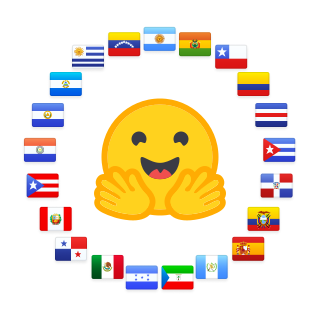

---
language:
  - es
pretty_name: "Corpus de Preguntas de Historia del Perú - Examenes Admisión UNMSM"
tags:
  - history
  - peru
  - education
  - multiple-choice
  - question-answering
  - unmsm
  - entrance-exam
license: apache-2.0
task_categories:
  - question-answering
  - multiple-choice
size_categories:
  - 1K<n<10K
multilinguality: "monolingual"
paperswithcode_id: null
---

# Corpus de Preguntas de Historia del Perú - Examenes Admisión UNMSM

<div align="center">
    
</div>


Este dataset contiene preguntas de opción múltiple sobre Historia del Perú extraídas de exámenes de admisión de la Universidad Nacional Mayor de San Marcos (UNMSM) aproximadamente entre 1970 y 2020.

Archivos de referencia utilizados, [aquí](https://github.com/mcdaqc/Corpus-Historia-Peru-ExamenAdmisionUNMSM-MultipleChoice/blob/main/files/data_ocr/cuestionario.pdf)

Para consultar los temas cubiertos en el corpus, [aqui](https://github.com/mcdaqc/Corpus-Historia-Peru-ExamenAdmisionUNMSM-MultipleChoice/blob/main/files/data_clean/categorias.txt)

## Formato del JSON

Cada pregunta en el dataset sigue el siguiente formato:

```json
{
  "language": "es",
  "country": "Perú",
  "exam_name": "Solucionario Exámenes de Admisión, Historia del Peru -  Universidad Nacional Mayor de San Marcos",
  "source": "https://www.slideshare.net/slideshow/historia-del-per-recopilacin-ex-adm-unmsm/251464302",
  "license": "Desconocida",
  "level": "Acceso a la Universidad",
  "category_en": "General Concepts of History",
  "category_original_lang": "CONCEPTOS GENERALES DE HISTORIA",
  "original_question_num": 1,
  "question": "La captura de Atahualpa, el rescate exigido, y la muerte del último inca se conoce fundamentalmente a través de:",
  "options": [
    "Los cronistas",
    "La tradición oral indígena.",
    "La tradición oral española.",
    "La tradición oral española.",
    "Los historiadores españoles"
  ],
  "answer": 0
}
```

